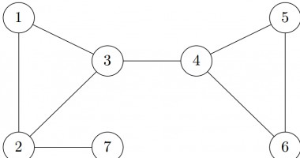
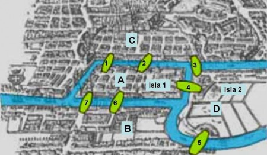

# Graph Theory 101

## What is Graph Theory?

Graph Theory is an important branch of mathematics. Graphs are mathematical structures which is used for modelling pairwise relationships between objects. In graph theory terms, these objects are called **vertices** and the relationship two objects is given by **edges** between them. Graphs are primarily of two types – **Directed Graphs** or **Undirected Graphs**. In directed graphs, edges are directed from one vertex to another. While in undirected graphs, edges connect two vertex so that relation is bidirectional.

Directed Graph

Undirected Graph

In above images, circles represent objects while the lines between them represent edges. Edges in directed graph are denoted by arrows while in undirected graph they are simply drawn as lines. In first image, edge “a” relates object “1” to object “2” but not vice versa. While in second image there is no direction associated with edges.

Traversing a graph means moving from one vertex to another using the edges. You can go from one vertex to another only if there is an edge between them. In directed graph we can move only in one direction using an edge. But in undirected graph we can move in both directions.

## An interesting story

The city of Königsberg in Prussia (now Kaliningrad, Russia) was situated on both sides of the Pregel River, and included two large islands – Kneiphof and Lomse – which were connected to each other, or to the two mainland portions of the city, by seven bridges. When Carl Gottileb Ehler – a mathematician became mayor of the nearby town, he kept thinking about a single problem: Is there any route that allows you to cross all the seven bridges without crossing any of them more than once?

Here, is the picture of Königsberg. The green shapes denote the bridges.

If you are trying to solve the problem then you are out of luck because such a route does not exist. Next we will see how [Euler](https://en.wikipedia.org/wiki/Leonhard_Euler) proved that this problem is impossible to solve.

## Graph Theory is discovered

While trying to explain why this problem is impossible to solve, Euler invented a field of mathematics which he called **Geometry of Positions**. Now, know as **Graph Theory**. But for understanding his solution we would need to reformulate the question in terms of graph theory. Let’s do that first.

We can mark the four lands as our objects – A, B, C, D and the bridges connecting them as edges. Since we can use bridges to move in either direction, we use undirected graph for this representation.

Drawing in more familiar way, here is the resulting graph.

So, we can reformulate our problem as follows –

**Is there any way for traversing the graph such that we use each and every edge exactly once?**

## Indegree and Outdegree

By definition, **Indegree** of a vertex is the number of edges that are coming towards that vertex and similarly, **Outdegree** is number of edges going out of a vertex. In case of Undirected Graphs, we do not distinguish between indegree and outdegree and simply refer to number of edges connected to a vertex as its **Degree**.

So, in our graph of Königsberg Bridges, degree of A is 5 while that of B, C and D is 3.

## Finally the solution

We can argue that for such a traversal to exist degree of all the vertices except for maybe 2 vertices must be even. That is excluding any two vertices, all the other vertices must have a even degree for the solution to exist.

### Why?

Because if we enter a vertex then we must also leave it but we cannot use the same edge that we used to enter it, so we must use a different edge. By this argument we can see that for every vertex we visit, there are two edges that we use. The vertex from which we start traversing and the vertex where we end it are exceptions. Because we start traversing from one vertex without entering it, and we can end our traversal in another vertex without leaving it. Therefore this two vertex need not have an even degree.

In our Königsberg Bridges graph, all the vertices have odd degree, so we cannot traverse the graph in a way that we cross every edge exactly once.

In Euler’s honour, we today call such a traversal of graph as **Eulerian path**. A different but related problem adds extra condition to this traversal that the starting and ending vertex must be the same. This traversal is called a **Eulerian circuit**. For Eulerian circuit to exist in the graph, all the vertices must have even degree. (Because this time we must enter back to the vertex from where we started the traversal).

## Conclusion

Graph Theory is a very useful branch of mathematics and has numerous applications in different fields of science. Especially, in computer science graph theory is used extensively in many places. Social Networks use it to represent connections among users. In maps, it is used to represent cities as vertices and roads between them as edges. Also standard graph algorithms like DFS, BFS, Topological Sort are used in various programming tasks.

## References

- [Seven Bridges of Königsberg – Wikipedia](https://en.wikipedia.org/wiki/Seven_Bridges_of_K%C3%B6nigsberg)
- [Graph Theory – Wikipedia](https://en.wikipedia.org/wiki/Graph_theory)
- [How the Königsberg bridge problem changed mathematics – Dan Van der Vieren](https://www.youtube.com/watch?v=nZwSo4vfw6c)
- [Mathematics | Graph Theory Basics – Set 1 – GeeksforGeeks](https://www.geeksforgeeks.org/mathematics-graph-theory-basics-set-1/)

This article has been written by my dear friend [Ram Nad](https://github.com/ram-nad).
