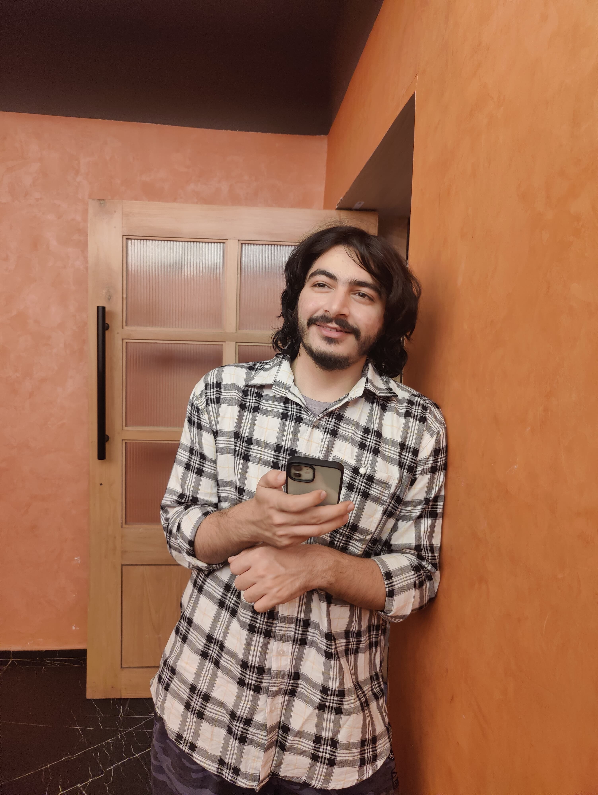

  

    
    
This is me patiently waiting outside a restaurant to have food.

  

  

    

    
Hello all and welcome to my blog. I am Sayam Kumar, an AI Research Engineer @ <a href="https://phaidra.ai">Phaidra</a> where we create AI-powered control systems for industrial processes.  

I love to work in the field of AI because I am inspired by observing how AI positively impacts various domains like healthcare, astronomy, climate-change, e-commerce, etc.  

In my free time, I like to travel, play chess and listen to Punjabi/Hindi music.  

This year I am looking forward to dig deeper into intersection of Reinforcement Learning and Bayesian statistics, improve my fitness consistently, and pick up learning violin.  
    

  

